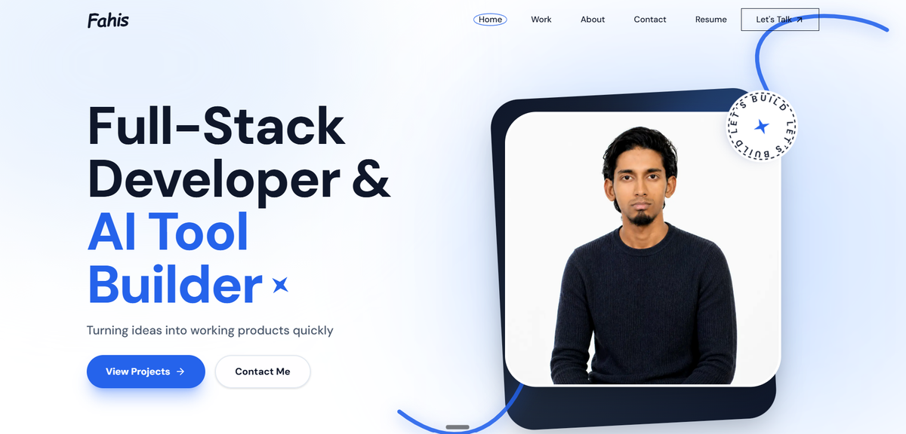
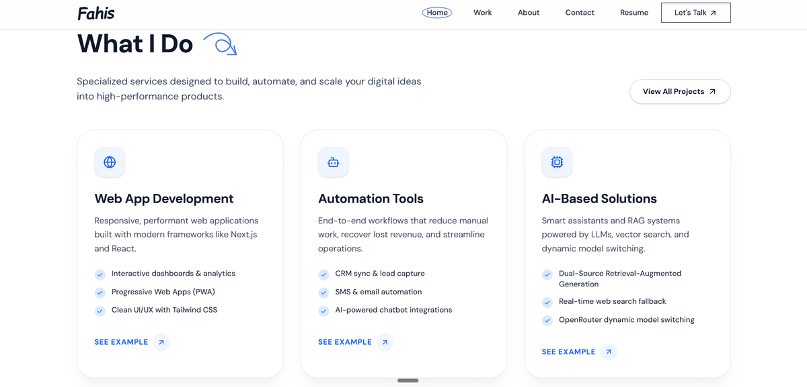
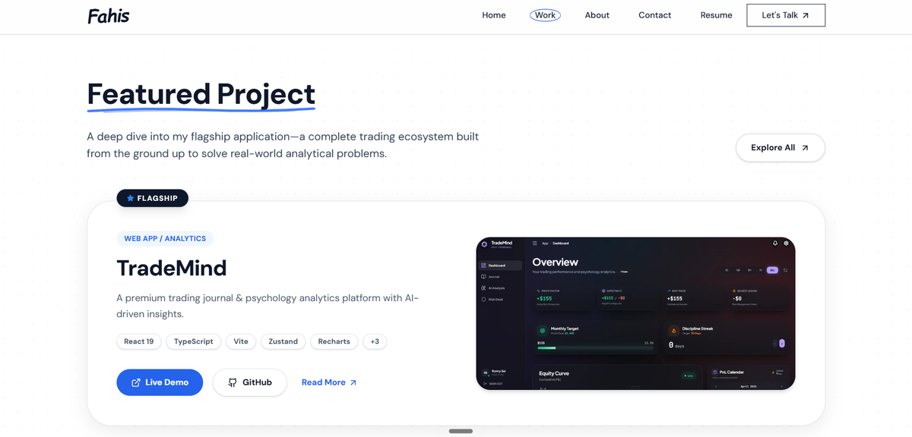
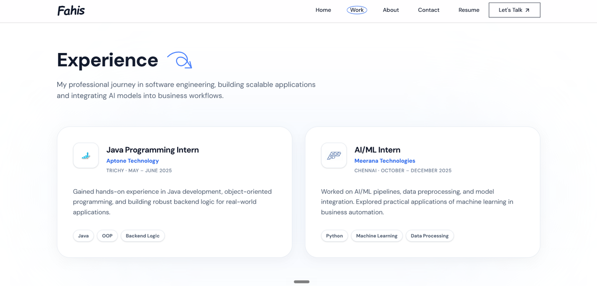
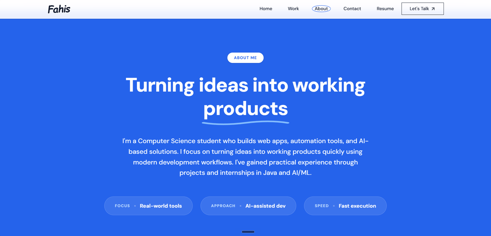
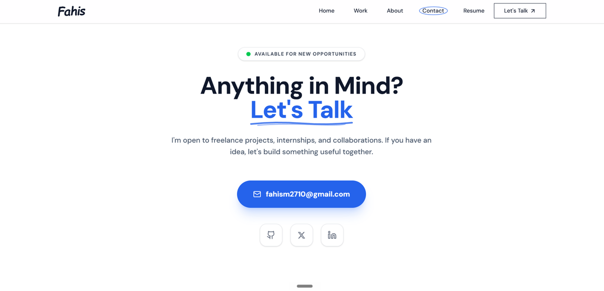

# Fahis M — Personal Portfolio

**[🚀 Live Demo](https://fahis.dev)**

**Fahis M Portfolio** is a modern, single-page developer portfolio engineered to elegantly showcase my top creations, including full-stack applications, AI-powered tools, and automation ecosystems. It features advanced scroll-driven animations and a highly sophisticated query-based routing system for deep context-aware navigation.

---

## 📸 Demo Gallery

### 1. Portfolio Interface
A high-impact cinematic hero section with modern typography and scroll-driven entry animations.

### 2. Services & Expertise
A clean overview of core technical services spanning Web App Development, Automation Tools, and AI Solutions.

### 3. Project Detail View
Immersive deep-dive pages for specific projects, dynamically handling breadcrumb routing back to the user's exact entry point.

### 4. Interactive Components
Smooth, layout-shifting project cards showcasing robust UI/UX principles and Framer Motion orchestrations.

### 5. Detailed Breakdown
Comprehensive explanations of complex architectural decisions for each showcased project.

### 6. Contact & Footer
A sleek, high-contrast footer featuring dynamic local time, direct social integrations, and a back-to-top interaction.

---

## ✨ Key Features

### 1. Advanced Context-Aware Routing
- Implements a sophisticated query-based navigation system (`?from=services`) ensuring users are returned to their exact scrolling origin when navigating deep within project sub-pages.
- Prevents disorientation and relies on strict URL parameters rather than fragile browser history.

### 2. Scroll-Driven Cinematic Animations
- Employs **Framer Motion** for performant, hardware-accelerated reveal effects and micro-interactions.
- Enhances user engagement through subtle visual feedback and dynamic layout shifts without compromising load speeds.

### 3. Optimized Asset Delivery
- Leverages the Next.js `<Image>` component for automatic lazy-loading, WebP format conversion, and responsive sizing.
- Ensures a perfect Lighthouse performance score despite heavy visual assets.

### 4. Flawless Mobile Responsiveness
- Built with a strict mobile-first Tailwind CSS architecture.
- Verified rendering across breakpoints from 320px mobile displays up to 4K ultra-wide monitors.

---

## 💻 Tech Stack

- **Frontend:** Next.js 15 (App Router), React 19, Tailwind CSS
- **Animations:** Framer Motion
- **Icons:** Lucide React
- **Deployment & Edge Network:** Vercel

---

## 🔒 Note on Source Code

This repository is for **showcase purposes only**. The underlying source code for this portfolio is proprietary and is kept in a private repository.

---

© 2026 Fahis M. All Rights Reserved.
